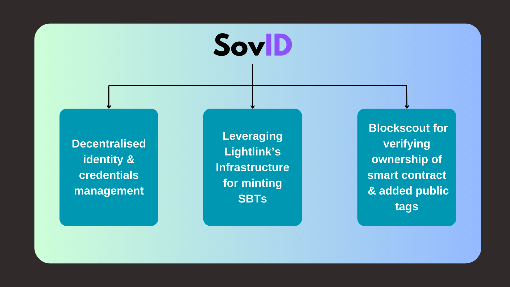
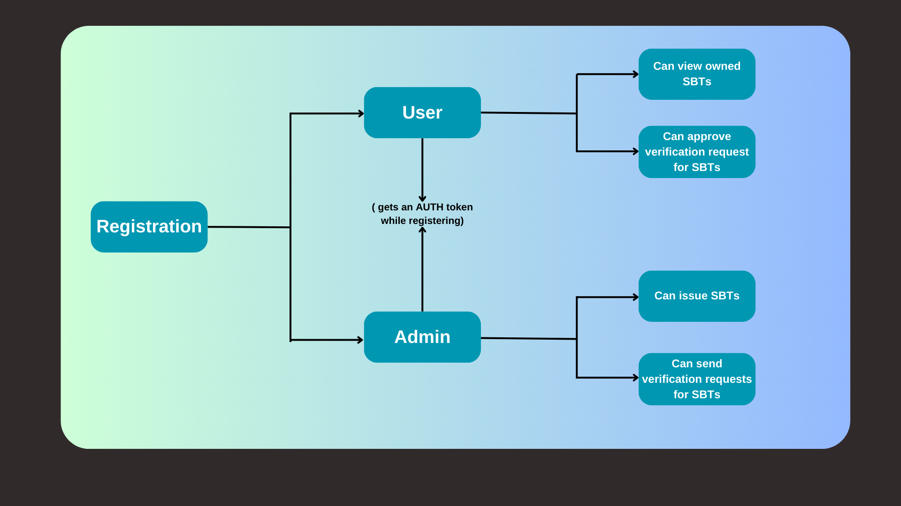
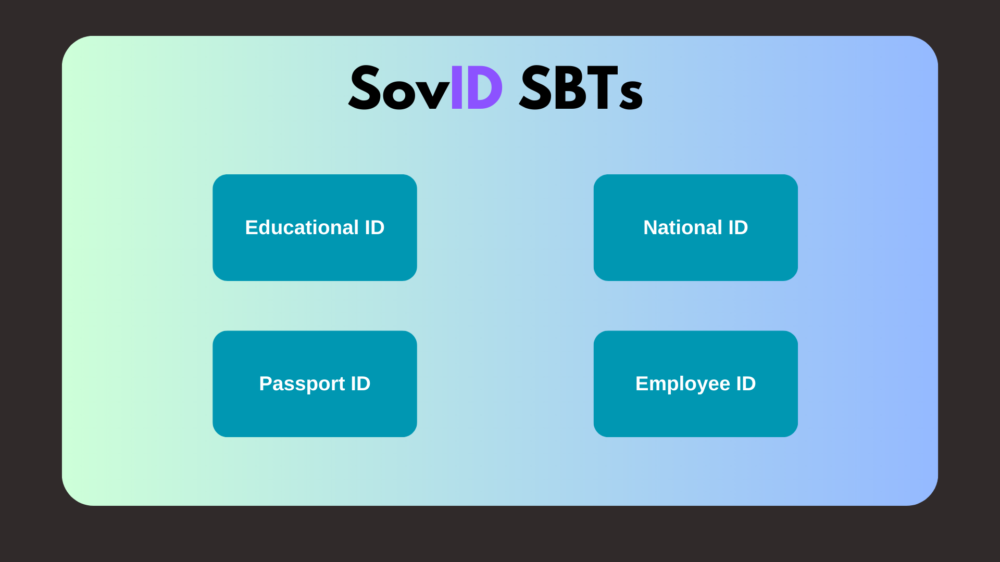

# SovID Protocol

Sovid is a decentralised identity and credentials management protocol on LightLink chain. SovID is your gateway to sovereign identity. We are leveraging LightLink Infrastructure to mint digital identities and credentials as NFTs (in form of SBTs).

## Table of Contents

1. [All Links](#links)
2. [Instructions to setup and run locally ](#instructions-to-setup)
3. [Deployed Contracts](#deployed-contracts)
4. [Protocol Specs](#protocol-specs)
5. [System Design](#system-design)
6. [App Demo](#app-demo)
7. [Tech Stack](#tech-stack)
8. [Our Solution (Architecture)](#our-solution-architecture)
9. [Team](#team)

## Links

- [Deployed URL](https://sov-id.vercel.app/)
- [Git Repo with README](https://github.com/0xAlphaDevs/SovID)
- [Presentation](https://docs.google.com/presentation/d/1vkp38iDjGH78wDCGSNC-ZiXjGE0wekTjaLOagAOP5o0/edit?usp=sharing)

## Instructions to Setup

Follow these instructions to set up and run the project:

**Using Github**

- Clone the Git repository: `https://github.com/0xAlphaDevs/SovID.git`
- Install project dependencies: `pnpm install`
- Start the development server: `pnpm run dev`
- Access the web app in your browser at [http://localhost:3000](http://localhost:3000)

## Deployed Contracts

- Authorization Token : `0x6FB9EB6826B0978510E6d2F7623c3bC9A3dC9627`
- Educational ID : `0x3DaA9b9f3Ba4A5828473075CE68C704FEC124E73`
- Employee ID : `0x456A103F7B5b8A5401a99eF244029b8C67c2BE78`
- National ID : `0x4612869797A1F8Ec40d5fC12FE17519674dAcf30`
- Passport ID : `0x8dc7202c27De1d423AE8011F898Ca172AF28B762`

## Protocol Specs

- Lightlink Pegasus Testnet
- Blockscout for verifying smart contracts and adding ownership and tags.
- Solidity & Hardhat for contracts development
- Tailwind CSS & Material Tailwind ( UI )
- Next JS & Vercel (Front-end & Deployment)

## System Design

## App Demo

## Tech Stack

- Blockscout
- Next JS
- Typescript
- Tailwind CSS
- Material Tailwind
- Connectkit
- wagmi
- view
- @wagmi/core
- Hardhat
- Solidity

## Our Solution (Architecture)

### Admin

- You can register as an Admin by providing your name and industry after connecting your wallet.
- An authorization token will be minted against the admin address to verify in future that the admin is registered or not on SovID.
- If registered you will be taken to the admin dashboard.
- An admin can issue the SovID specified SBTs to users.
- Can send verification requests for SBTs.

### User

- You can register as a User by providing your name after connecting your wallet.
- An authorization token will be minted against the user address to verify in future that the user is registered or not on SovID.
- If registered you will be taken to the user dashboard.
- A user can view the SovID owned SBTs .
- Can approve verification requests from admins.

## Team

Team [AlphaDevs](https://alphadevs.dev) 👇

### Github

[Harsh Tyagi](https://github.com/mr-harshtyagi)
[Yashasvi Chaudhary](https://github.com/0xyshv)

### Twitter / X

[Harsh Tyagi](https://twitter.com/mr_harshtyagi)
[Yashasvi Chaudhary](https://twitter.com/0xyshv)

## Thanks

- Feel free to reach out to the [AlphaDevs team](https://alphadevs.dev) with any questions or issues.

- We appreciate your interest in our project and welcome contributions and feature suggestions.
